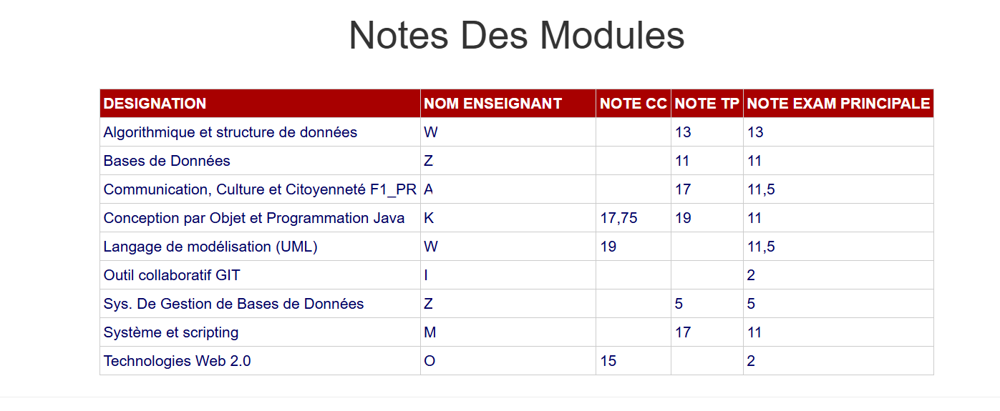
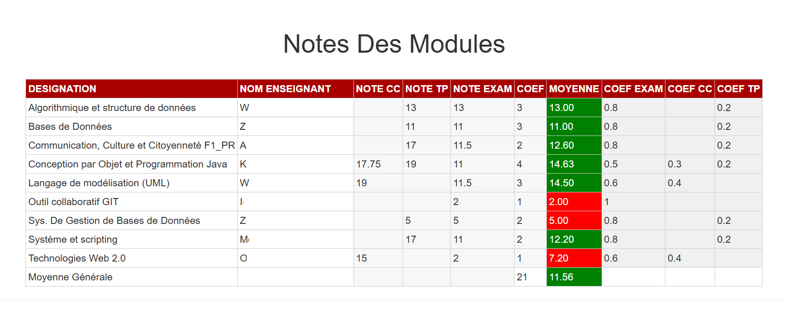

# Grade Calculator – Esprit Cours du Soir

A Chrome extension designed for **Esprit Cours du Soir** students to automatically calculate averages based on the grade table on the student portal. With one click, the extension enhances the table with per-subject averages, a general average, and editable fields for simulating different results.

## Features

- **Automatic Average Calculation**: Calculates per-subject and overall average based on the Esprit grade table (ID: `ContentPlaceHolder1_GridView1`).
- **Color Indicators**: Grades ≥ 8 shown in green (passing), < 8 in red (failing).
- **Editable Fields**: Modify grades (`NOTE CC`, `NOTE TP`, `NOTE EXAM`) and coefficients (`COEF`, `COEF EXAM`, `COEF CC`, `COEF TP`) to simulate different scenarios.
- **Customizable Coefficients**: You can leave fields like `COEF CC` or `COEF TP` empty to disable them, or set custom values.
- **Easy to Use**: Simply activate it via the Chrome toolbar icon.

## Installation Instructions

1. **Download the Extension**:

   - Clone this repository or download the ZIP file, then extract it to a folder.

2. **Load the Extension in Chrome**:

   - Open Chrome and go to `chrome://extensions/`.
   - Enable **Developer Mode** (top right).
   - Click **Load unpacked** and select the folder.
   - The **Grade Calculator** extension will appear in your toolbar.

   

## Usage

1. **Access the Grade Table**:

   - Log in to the Esprit student portal and open the page showing your grade table.

2. **Activate the Calculator**:

   - Click the extension icon in Chrome.
   - The table will automatically be enhanced with calculations and editable fields.

3. **Interact with the Table**:
   - View per-subject averages and the general average in the `MOYENNE` column.
   - Edit grades or coefficients to simulate different outcomes.
   - To disable a coefficient like `COEF CC`, simply leave it blank.

## Files

- `manifest.json`: Declares permissions, scripts, and configuration.
- `background.js`: Handles extension icon activation.
- `content.js`: Main logic for table parsing, calculations, and interactivity.
- `popup.html`: Simple guide message for users.
- `icon.png`: Extension icon.

## Screenshots

- Before activation  
  

- After activation  
  

## Notes for Esprit Students

- This extension is optimized for the Esprit grade table (ID: `ContentPlaceHolder1_GridView1`).
- Supports European decimal format (`12,5` = 12.5).
- If the table doesn’t load, check the browser console (Right-click > Inspect > Console) for errors.

## Contributing

Contributions are welcome!

- Open an issue to suggest an idea.
- Submit a pull request with improvements.

## Acknowledgments

- Built for **Esprit Cours du Soir** students to simplify grade tracking and experimentation.
- Inspired by the need for a fast, interactive tool for academic planning.

---

Happy grade calculating! If you find this extension helpful, star this repository and share it with your classmates! 🌟
